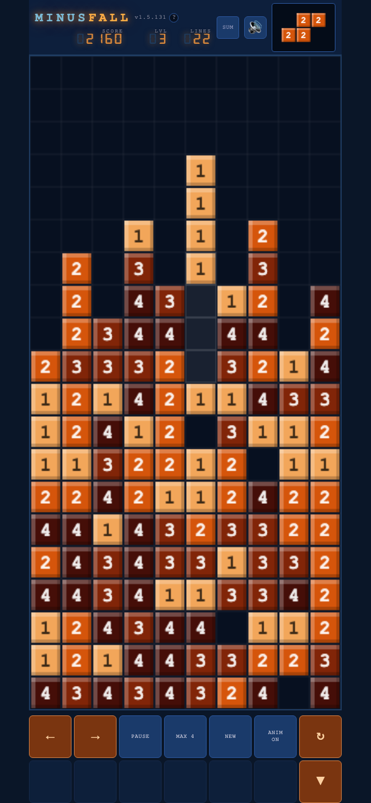

# MinusFall

> **Subtetris has been renamed to MinusFall.**

A falling-block puzzle where blocks carry numbers and rows are cleared by **subtraction** instead of deletion.

**[Try MinusFall in your browser](http://minusfall.gydd.com/)**

[](http://minusfall.gydd.com/)

Also available on the [App Store](https://apps.apple.com/us/app/minusfall/id6761745947).

---

## App Store Subtitle

**Pick: "Stack, subtract, cascade"** — captures the three-phase gameplay loop; dynamic and concise.

Other options considered:
- "Subtract to clear, chain to win"
- "Numbers fall. Math clears."
- "The falling-block math puzzle"
- "Clear by subtraction"

---

## App Store Promotional Text

What if clearing a row wasn't the end? In Minusfall, numbers survive, blocks hang, and one smart drop can trigger a cascade you never saw coming.

---

## How It Works

Seven tetromino shapes fall onto a 10×20 board, but each cell carries a number (1–4). When a row fills up, the game subtracts the row's **minimum value** from every cell — cells that reach zero disappear, the rest survive and fall.

This creates cascading chain clears, surviving blocks tumbling down, and a puzzle-like layer on top of classic falling-block play.

### Key Rules

- **Row clear:** subtract the row's minimum value; cells at 0 vanish
- **Cascade gravity:** cells above gaps fall into them; connected hanging blocks fall together
- **Chains:** if falling blocks form new full rows, the process repeats
- **MAX # setting:** controls the number range (1 = all ones, classic falling-block feel; 4 = numbers 1–4)
- **Support Model:** `GND` (ground-based gravity) or `CLU` (cluster-based gravity)
- **Score:** standard line-clear scoring × level; +1 per soft-drop row
- **Speed:** constant drop speed (NES level 1 pace, ~800ms)

## KEYWORDS
tetris,minusfall,minus,puzzle,blocks,numbers,subtraction,arcade,stack

---

## Controls

### Keyboard
| Key | Action |
|-----|--------|
| ← → | Move |
| ↓ | Soft drop (hold) |
| ↑ | Rotate |
| Space / P | Pause / Unpause |
| N | New game |

### Mobile (touch)
| Gesture | Action |
|---------|--------|
| Tap board | Rotate |
| Flick left/right | Move |
| Drag down | Soft drop |
| Bottom buttons | Controls + settings |

---

## Tech Stack

- **Single HTML file** (`docs/index.html`) — no framework, no build step
- **HTML5 Canvas** for the game board and piece preview
- **Web Audio API** for sound effects
- **Capacitor 6** for iOS app wrapping (`com.subtetris.app`)
- **DSEG7-Classic** font for the LED-style score display

---

## Project Structure

```
docs/
  index.html            # Entire game — HTML, CSS, JS in one file
  support.html
  privacy.html
  icons/                # Web icons used by the game page
capacitor.config.json
package.json
ios/
  App/
    App.xcodeproj       # Xcode project (Capacitor-generated)
icons/                  # App icon assets
changelog.txt           # Full version history
CLAUDE.md               # Living design spec
```

---

## Development

```bash
# Serve locally
npm run serve
# → http://localhost:3456

# Sync to iOS
npm run cap:sync

# Open in Xcode
npm run cap:ios
```

---

## Building for iOS

1. `npm run cap:sync` — syncs the `docs/` web root to iOS
2. `npm run cap:ios` — opens Xcode
3. In Xcode: select your signing team, choose a device/simulator, hit Run

---

## Changelog

See [changelog.txt](changelog.txt) for full version history.

Current version: **v2.0.0**

## APP STORE NOTES (when submitting a new version for review)
No login or account required. Tap NEW GAME to start playing immediately. The game is a single-player puzzle — stack numbered blocks, fill rows to trigger subtraction-based clears, and chain combos for high scores.

### HOW TO PLAY
• Stack falling pieces to fill rows
• A full row triggers subtraction — the row minimum is subtracted from every block in that row
• Blocks reduced to zero vanish
• Blocks above the gaps fall down — triggering further clears
• Chain deep combos for massive scores

### SCORING
• Bigger numbers to subtract = more points
• Clear multiple rows at once = exponential bonus
• Score multiplies with level

### CONTROLS
• Tap left/right to move
• Tap rotate to spin the piece
• Tap drop to speed up
• Swipe on the board for quick moves
